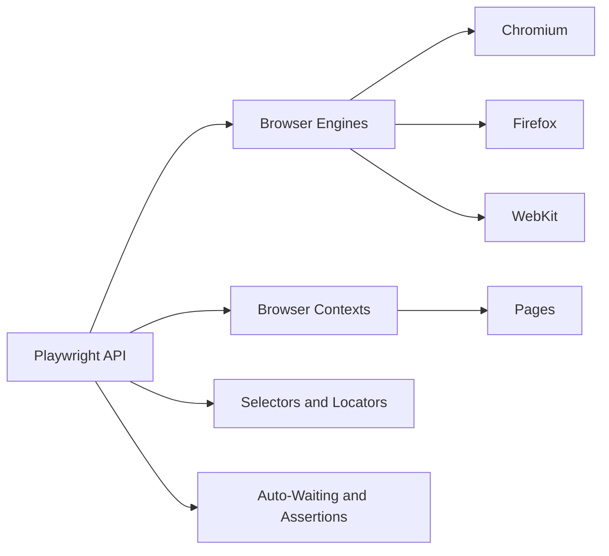
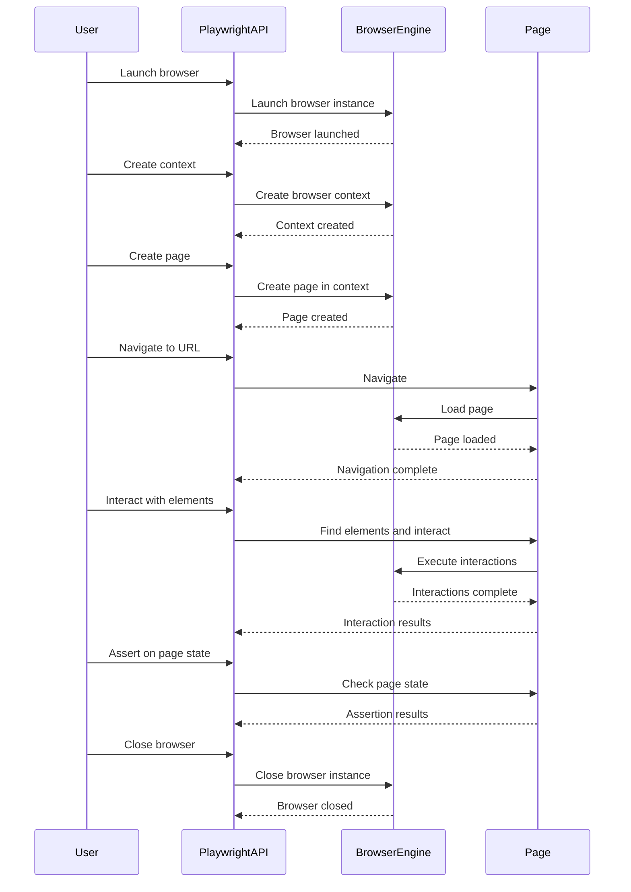
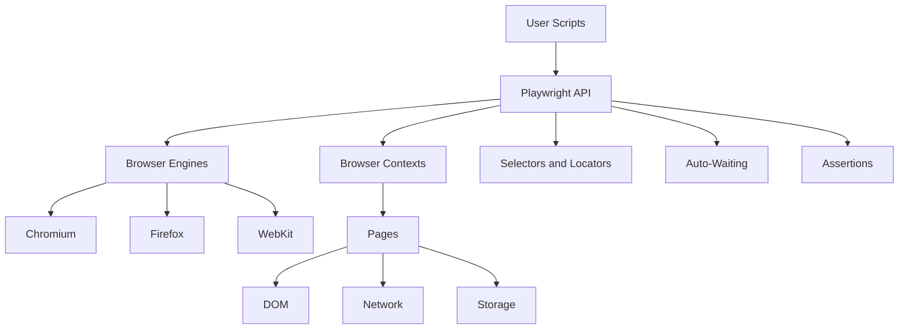

# Playwright Architecture Documentation

## Overview
Playwright is a high-level API for automating web browsers. It enables cross-browser testing and automation across Chromium, Firefox, and WebKit with a single, unified API. The goal of Playwright is to provide an ever-green, capable, reliable and fast framework for web testing and automation.

## Key Architectural Components

### Browser Engines
Playwright supports three major browser engines:
1. Chromium 
2. Firefox
3. WebKit

Each browser engine is integrated into Playwright, allowing it to control the browser programmatically.

### Playwright API
The Playwright API is the high-level interface that users interact with to automate and test web pages. It provides methods to launch browsers, create pages, navigate, interact with elements, and assert on page states. The API is designed to be concise, easy to use, and resilient to changes in the underlying browser engines.

### Browser Contexts
Browser Contexts are isolated execution environments within a browser instance. Each context has its own set of pages, cookies, and other state. Contexts allow for parallel and independent test execution.

### Selectors and Locators
Playwright provides powerful selectors and locators to find and interact with elements on a page. These include CSS selectors, XPath, and text-based selectors. Locators are a higher-level abstraction over selectors that automatically wait for elements and provide better ergonomics.

### Auto-Waiting and Assertions
Playwright automatically waits for elements to be visible and actionable before interacting with them. This eliminates the need for explicit waits in most cases. The API also provides built-in assertions to check for page states and element properties.

## Data Flow

1. The user writes a script using the Playwright API.
2. The script launches a browser instance (Chromium, Firefox, or WebKit) using the specified configuration.
3. Browser contexts are created within the browser instance to isolate test execution.
4. Pages are created within the browser contexts, and navigation commands are sent to load web pages.
5. The script uses selectors and locators to find elements on the page and interact with them (click, type, etc.).
6. Playwright sends the appropriate commands to the browser engine to perform the specified actions.
7. The browser engine executes the commands and updates the page state.
8. Playwright auto-waits for the page to reach a stable state and elements to be ready.
9. Assertions are used to verify the expected page state and element properties.
10. The script continues execution until completion, and then closes the browser instance.

## Mermaid Diagrams

### Component Diagram

### Sequence Diagram

### Architecture Diagram

## Design Patterns

### Facade Pattern
The Playwright API acts as a facade, providing a simplified and unified interface to interact with multiple browser engines. It hides the complexities of the underlying browser automation and presents a clean, high-level API to the users.

### Factory Pattern
Playwright uses the factory pattern to create instances of browsers, contexts, and pages. The `launch` method is a factory that creates a new browser instance based on the provided configuration. Similarly, `newContext` and `newPage` methods create new contexts and pages respectively.

### Fluent Interface
Playwright's API is designed as a fluent interface, allowing method chaining for a more readable and expressive code. For example, `page.goto(url).then(() => page.click(selector))` chains navigation and interaction commands.

### Proxy Pattern
Playwright uses the proxy pattern to intercept and modify network requests and responses. The `page.route` method allows users to register request handlers that can modify, abort, or continue requests based on certain conditions.

## Technical Decisions and Rationales

### Supporting Multiple Browser Engines
Decision: Playwright supports Chromium, Firefox, and WebKit browser engines.
Rationale: By supporting multiple browser engines, Playwright enables cross-browser testing and ensures that web applications work consistently across different browsers. It allows users to write a single test suite that can be run against multiple browsers, saving development and maintenance effort.

### High-Level API
Decision: Playwright provides a high-level API for browser automation and testing.
Rationale: A high-level API abstracts away the low-level details of browser automation and provides a more user-friendly and expressive interface. It allows users to focus on the testing logic rather than the intricacies of browser control. The high-level API also makes the tests more readable, maintainable, and less prone to breaking due to changes in the underlying browser engines.

### Auto-Waiting and Assertions
Decision: Playwright automatically waits for elements to be ready and provides built-in assertions.
Rationale: Auto-waiting eliminates the need for explicit waits and sleeps in most cases, making the tests more reliable and less flaky. By waiting for elements to be visible, attached, and stable, Playwright ensures that interactions and assertions are performed on ready elements. Built-in assertions simplify the process of verifying page states and element properties, reducing the amount of boilerplate code required.

### Browser Contexts
Decision: Playwright introduces the concept of browser contexts for isolated execution environments.
Rationale: Browser contexts provide a way to isolate test execution and maintain independent states. Each context has its own set of pages, cookies, and other storage, allowing for parallel and independent test runs. Contexts also enable testing scenarios that require multiple pages or user profiles, such as testing a chat application or a multi-user workflow.

### Selector and Locator Strategies
Decision: Playwright supports various selector and locator strategies, including CSS, XPath, and text-based selectors.
Rationale: Different selector strategies cater to different use cases and preferences. CSS selectors are commonly used and well-understood by web developers. XPath provides more advanced querying capabilities. Text-based selectors allow for more human-readable and maintainable selectors. By supporting multiple strategies, Playwright gives users the flexibility to choose the most appropriate selector for their needs.

This architecture documentation provides an overview of the Playwright framework, its key components, data flow, design patterns, and technical decisions. The included Mermaid diagrams visually represent the architecture and interactions between components. This documentation serves as a starting point for understanding the high-level structure and design principles of Playwright.