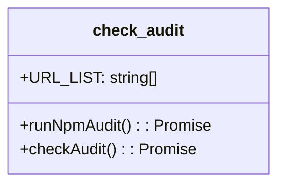

# check_audit.js Documentation

## Purpose and Responsibilities

The `check_audit.js` component is responsible for running an npm audit on the project and checking for vulnerabilities. It filters out specific vulnerabilities based on a predefined list of URLs and reports any remaining valid vulnerabilities. If any valid vulnerabilities are found, the component exits with a non-zero status code.

## Key Functions

### `runNpmAudit()`

- Description: Runs the `npm audit --omit dev --json` command using `child_process.exec()` and returns a promise that resolves with the command's stdout output or rejects with an error message if the command fails.
- Returns: A promise that resolves with the stdout output of the npm audit command.

### `checkAudit()`

- Description: Parses the JSON output from `runNpmAudit()`, filters out vulnerabilities based on the `URL_LIST`, and reports any remaining valid vulnerabilities. If valid vulnerabilities are found, it exits the process with a status code of 1.
- Returns: A promise that resolves if no valid vulnerabilities are found or rejects with an error message if the `runNpmAudit()` function fails.

## Dependencies and Relationships

The `check_audit.js` component depends on the following:

- `child_process` module from Node.js for running the npm audit command.
- The project's `package.json` file and its dependencies for running the npm audit.

## Mermaid Class Diagram



## Usage Examples

To use the `check_audit.js` component, simply run the script using Node.js:

```bash
node check_audit.js
```

The component will run the npm audit, filter vulnerabilities, and report any valid vulnerabilities found. If no valid vulnerabilities are found, it will output "No vulnerabilities found" and exit with a status code of 0. If valid vulnerabilities are found, it will output the vulnerability details and exit with a status code of 1.

## Important Implementation Details

- The `URL_LIST` constant contains a list of URLs that should be excluded from the vulnerability report. Vulnerabilities associated with these URLs are considered false positives and are filtered out.
- The `runNpmAudit()` function uses `child_process.exec()` to run the npm audit command with the `--omit dev --json` flags, which excludes dev dependencies and outputs the result in JSON format.
- The `checkAudit()` function parses the JSON output from `runNpmAudit()`, filters out vulnerabilities based on the `URL_LIST`, and reports any remaining valid vulnerabilities.
- The component manually catches and reports any errors that occur during the execution of `checkAudit()`.
- The component can be run manually using `npm audit --omit dev` to see the vulnerabilities in a human-friendly format.