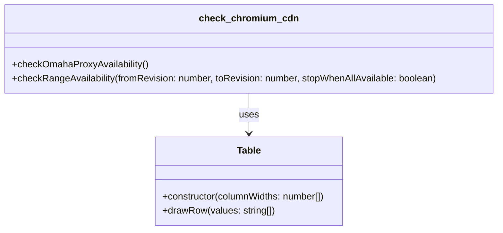

# check_chromium_cdn.js Documentation

## Purpose and Responsibilities

The `check_chromium_cdn.js` component is a Node.js script that checks the availability of different prebuilt Chromium revisions on the Chromium CDN (Content Delivery Network). It provides functionality to:

- Check the availability of a specific range of Chromium revisions
- Check the availability of the latest Chromium revisions based on the OmahaProxy service
- Display the availability status of Chromium revisions for supported platforms (Linux, Mac, Win64)

## Key Classes and Functions

### Table Class

The `Table` class is responsible for drawing a table in the console to display the availability status of Chromium revisions.

- `constructor(columnWidths: number[])`: Initializes a new instance of the `Table` class with the specified column widths.
- `drawRow(values: string[])`: Draws a row in the table with the provided values.

### checkOmahaProxyAvailability Function

The `checkOmahaProxyAvailability` function checks the availability of the latest Chromium revisions based on the OmahaProxy service.

### checkRangeAvailability Function

The `checkRangeAvailability` function checks the availability of a specific range of Chromium revisions.

- `fromRevision: number`: The starting revision number.
- `toRevision: number`: The ending revision number.
- `stopWhenAllAvailable: boolean`: Flag indicating whether to stop checking when all revisions are available.

## Dependencies and Relationships

The `check_chromium_cdn.js` component has the following dependencies:

- `assert`: Node.js built-in module for making assertions.
- `https`: Node.js built-in module for making HTTPS requests.
- `util`: Node.js built-in module for utility functions.
- `URL`: Node.js built-in module for URL parsing and manipulation.

## Component Diagram



## Usage Examples

1. Check the availability of a specific range of Chromium revisions:

```bash
node check_revisions.js 123456 789012
```

2. Check the availability of the latest Chromium revisions based on the OmahaProxy service:

```bash
node check_revisions.js
```

## Important Implementation Details

- The script uses HTTPS requests to check the availability of Chromium revisions on the Chromium CDN.
- The supported platforms for Chromium revisions are defined in the `SUPPORTER_PLATFORMS` array.
- The script uses ANSI escape codes to add colors to the console output.
- The script handles command-line arguments to determine the mode of operation (checking a specific range or checking the latest revisions).

Please note that this documentation provides an overview of the `check_chromium_cdn.js` component based on the provided code snippet. Some implementation details may be missing or incomplete due to the truncated nature of the code.