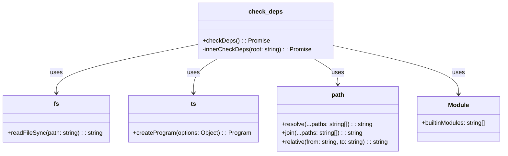

# check_deps.js Documentation

## 1. Purpose and Responsibilities

The `check_deps.js` component is a Node.js script responsible for checking dependencies within the Playwright project. Its main purposes are:

- Checking dependencies for various packages within the Playwright project.
- Comparing dependency versions between the `playwright-core` and `playwright` packages to ensure consistency.
- Exiting the process with an appropriate status code based on whether there are version mismatches.

## 2. Key Functions

### `checkDeps()`

The `checkDeps()` function is the main entry point of the script. It performs the following tasks:

1. Calls `innerCheckDeps()` for multiple packages within the Playwright project.
2. Retrieves the package.json files for `playwright-core` and `playwright` packages.
3. Compares the dependency versions between the two packages.
4. Logs any version mismatches found.
5. Exits the process with a status code of 1 if there are version mismatches, otherwise exits with a status code of 0.

### `innerCheckDeps(root)`

The `innerCheckDeps(root)` function is responsible for checking dependencies for a specific package. It takes the root directory of the package as a parameter and performs the following steps:

1. Logs the package being checked.
2. Initializes a set to store dependencies.
3. Attempts to load the package.json file for the package.
4. Creates a TypeScript program using the source files in the package's "src" directory.
5. Analyzes the source files to extract dependencies.
6. Checks each dependency against predefined rules and reports any errors.
7. Returns the package.json object.

## 3. Dependencies and Relationships

The `check_deps.js` component has the following dependencies:

- `fs`: Built-in Node.js module for file system operations.
- `ts` (TypeScript): Used for parsing and analyzing TypeScript source files.
- `path`: Built-in Node.js module for path manipulation.
- `Module`: Built-in Node.js module for working with modules.

It also relies on the directory structure of the Playwright project, specifically the "packages" directory containing various sub-packages.

## 4. Mermaid Class Diagram



## 5. Usage Examples

To run the `check_deps.js` script, execute the following command:

```bash
node check_deps.js
```

The script will check the dependencies for various packages within the Playwright project and report any version mismatches found between the `playwright-core` and `playwright` packages.

## 6. Important Implementation Details

- The script uses TypeScript's `createProgram` function to parse and analyze the source files of each package.
- It maintains a cache of dependencies (`depsCache`) to avoid redundant processing.
- The script defines a set of allowed dependencies (`allowList`) and a set of peer dependencies (`peerDependencies`) that are exempted from certain checks.
- It reports errors for dependencies that are not in the allow list or are not properly imported.
- The script compares the dependency versions between the `playwright-core` and `playwright` packages to ensure consistency.