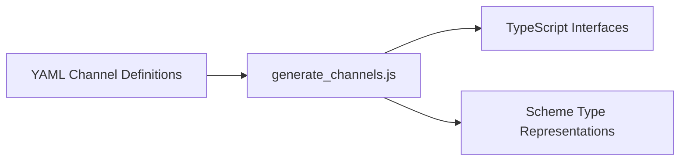

# generate_channels.js Documentation

## 1. Purpose and Responsibilities

The `generate_channels.js` component is a Node.js script responsible for generating TypeScript and Scheme type definitions for channels used in the Playwright project. It reads channel definitions from YAML files and generates corresponding TypeScript interfaces and Scheme type representations.

The main responsibilities of this component are:
- Parsing channel definitions from YAML files
- Generating TypeScript interfaces for channels
- Generating Scheme type representations for channels
- Handling mixins and derived classes
- Writing the generated code to output files

## 2. Key Functions and Classes

### Functions

- `raise(item)`: Throws an error with the stringified representation of the provided `item`.
- `titleCase(name)`: Converts the first character of the provided `name` to uppercase.
- `inlineType(type, indent, wrapEnums = false)`: Generates inline TypeScript and Scheme type representations for the given `type`.
- `properties(properties, indent, onlyOptional)`: Generates TypeScript and Scheme type representations for the provided `properties`.
- `renderList(list, separator)`: Renders a list of items with the specified `separator`.
- `renderMethod(className, method, indent)`: Renders a method definition for the given `className` and `method`.
- `renderMethods(className, methods, indent)`: Renders all methods for the given `className` and `methods`.
- `renderChannel(name, channel)`: Renders the TypeScript interface and Scheme type representation for the given `name` and `channel`.

### Classes

This component does not define any classes.

## 3. Dependencies and Relationships

The `generate_channels.js` component has the following dependencies:
- `fs`: Node.js built-in module for file system operations
- `os`: Node.js built-in module for operating system-related utility methods
- `path`: Node.js built-in module for file and directory path manipulation
- `yaml`: Third-party library for parsing and stringifying YAML

This component is a standalone script and does not have direct relationships with other components in the Playwright project. However, it generates code that is used by other parts of the project.

## 4. Mermaid Class or Component Diagram



## 5. Usage Examples

To use the `generate_channels.js` component, follow these steps:

1. Ensure that the required dependencies (`fs`, `os`, `path`, `yaml`) are installed.
2. Define channel definitions in YAML files.
3. Run the `generate_channels.js` script using Node.js:
   ```
   node generate_channels.js
   ```
4. The script will generate TypeScript interfaces and Scheme type representations based on the channel definitions.
5. The generated code will be written to output files specified in the script.

## 6. Important Implementation Details

- The script reads channel definitions from YAML files located in a specific directory.
- It supports various types such as binary, JSON, string, boolean, number, undefined, arrays, enums, and objects.
- Mixins and derived classes are handled by merging properties and methods from the base classes.
- The generated TypeScript interfaces and Scheme type representations are written to separate output files.
- The script follows a specific naming convention for generated types and interfaces.
- Error handling is implemented using the `raise` function to throw errors with meaningful messages.

Please note that this documentation provides an overview of the `generate_channels.js` component based on the provided code snippet. For more detailed information, refer to the complete source code and any additional documentation available in the Playwright project.