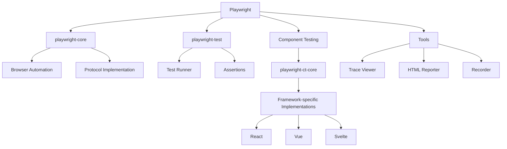
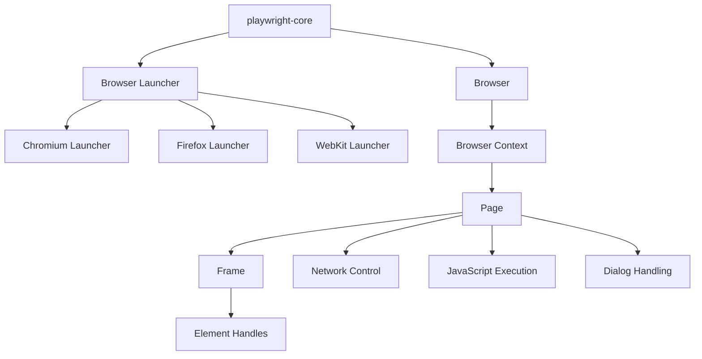
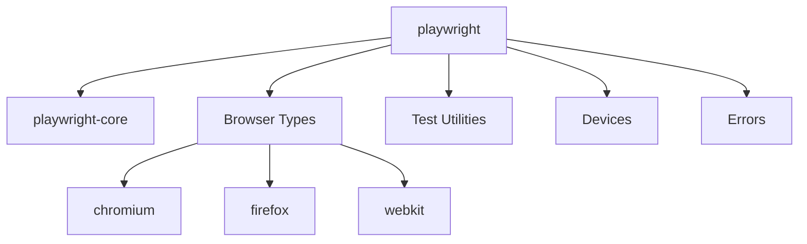
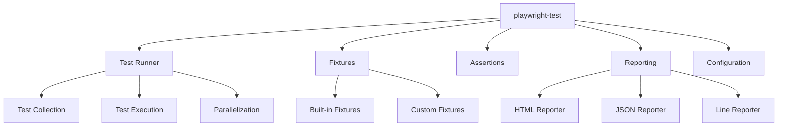
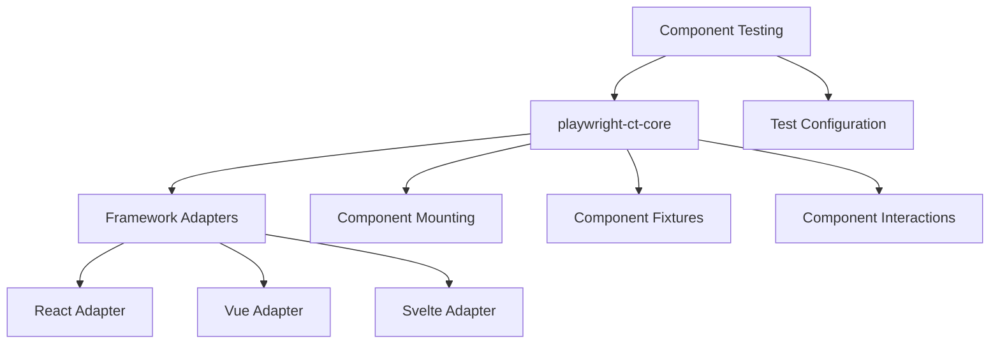
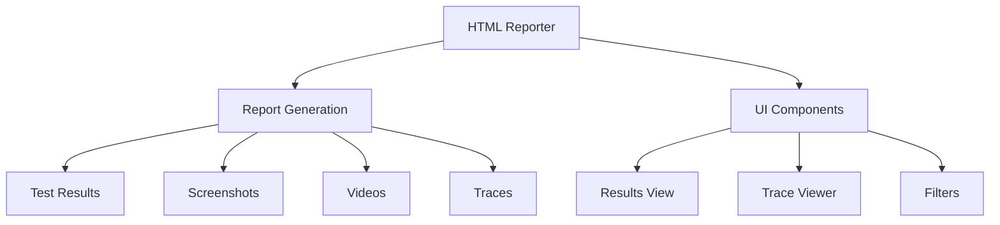
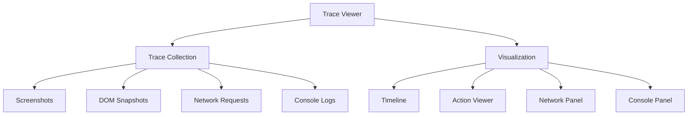
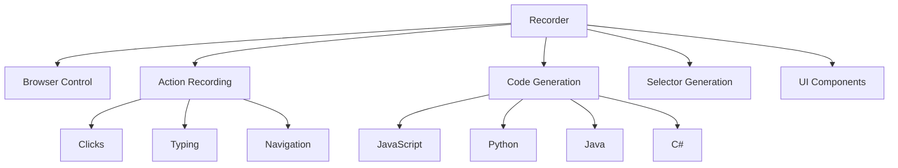
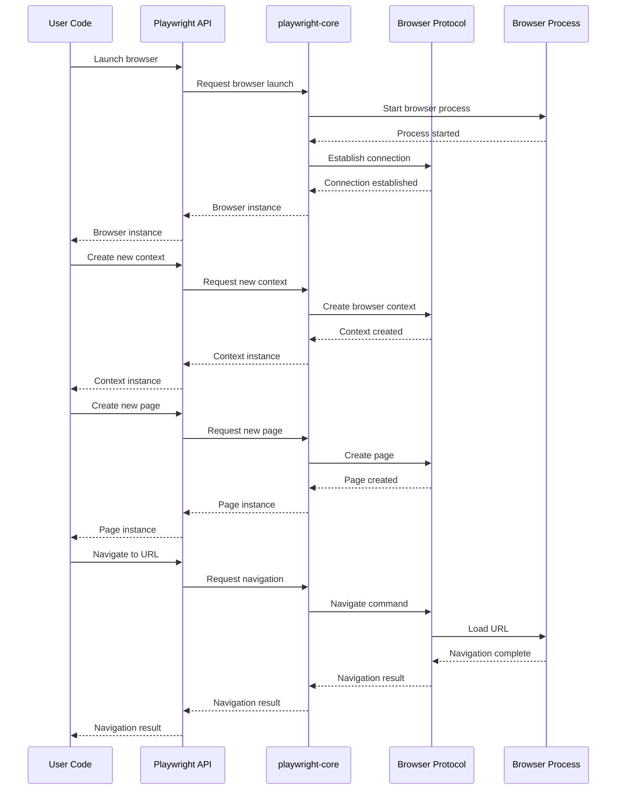
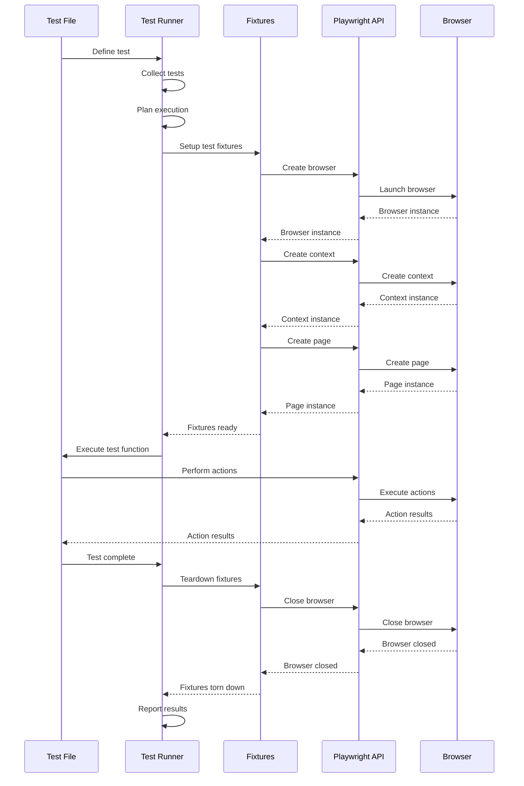

# Playwright Components Documentation

## High-Level Overview

Playwright is a comprehensive browser automation framework that enables reliable end-to-end testing for modern web applications. It provides a unified API to automate Chromium, Firefox, and WebKit browsers, supporting cross-browser testing on Windows, Linux, and macOS.



The Playwright ecosystem consists of several interconnected components that work together to provide a comprehensive testing and automation solution:

1. **Core Browser Automation** - The foundation that enables controlling browsers
2. **Test Runner** - A complete testing framework built on top of the automation layer
3. **Component Testing** - Framework-specific solutions for testing UI components
4. **Supporting Tools** - Utilities for debugging, reporting, and test creation

## Detailed Component Documentation

### 1. Core Browser Automation (`playwright-core`)

#### Purpose and Functionality
The `playwright-core` package is the foundation of Playwright, providing browser automation capabilities without bundling any browsers. It implements the core protocol for communicating with browsers, manages browser processes, and provides the API surface for browser automation.

#### Key APIs
- **Browser Launchers**: APIs to start and connect to browser instances
- **Browser Context**: Isolated browser sessions (similar to incognito profiles)
- **Page**: Representation of a browser tab or window
- **Frame**: Frame within a page
- **Element Handles**: References to DOM elements
- **Network Control**: Interception and modification of network requests

#### Usage Patterns
```javascript
// Basic automation pattern
const { chromium } = require('playwright-core');

(async () => {
  const browser = await chromium.launch();
  const context = await browser.newContext();
  const page = await context.newPage();
  await page.goto('https://example.com');
  // Perform actions and assertions
  await browser.close();
})();
```

#### Dependencies
- Relies on browser-specific protocols (CDP for Chromium, custom protocols for Firefox and WebKit)
- Requires access to browser executables (provided separately)

#### Extension Points
- Custom browser executable paths
- Launch options customization
- Browser context parameters
- Network interception hooks



### 2. Browser-Specific Packages

#### Purpose and Functionality
Playwright provides browser-specific packages that extend `playwright-core` with browser installations:
- `playwright-chromium`: Chromium-specific implementation
- `playwright-firefox`: Firefox-specific implementation
- `playwright-webkit`: WebKit-specific implementation
- Browser installation packages: `@playwright/browser-chromium`, `@playwright/browser-firefox`, `@playwright/browser-webkit`

#### Key APIs
Each browser package exports browser-specific launcher:
```javascript
const { chromium } = require('playwright-chromium');
const { firefox } = require('playwright-firefox');
const { webkit } = require('playwright-webkit');
```

#### Usage Patterns
```javascript
// Using a specific browser package
const { firefox } = require('playwright-firefox');

(async () => {
  const browser = await firefox.launch();
  const page = await browser.newPage();
  await page.goto('https://example.com');
  await browser.close();
})();
```

#### Dependencies
- Each package depends on `playwright-core`
- Browser installation packages contain browser binaries or download them on installation

### 3. Main Playwright Package (`playwright`)

#### Purpose and Functionality
The `playwright` package is the main entry point for most users. It combines `playwright-core` with all three browser implementations, providing a unified API for automating Chromium, Firefox, and WebKit.

#### Key APIs
- **Browser Launchers**: `chromium`, `firefox`, `webkit`
- **Test Utilities**: Various testing helpers
- **Devices**: Predefined device emulation settings
- **Errors**: Standardized error types

#### Usage Patterns
```javascript
const { chromium, firefox, webkit } = require('playwright');

// Cross-browser testing pattern
for (const browserType of [chromium, firefox, webkit]) {
  const browser = await browserType.launch();
  const page = await browser.newPage();
  await page.goto('https://example.com');
  // Perform cross-browser testing
  await browser.close();
}
```

#### Dependencies
- Depends on `playwright-core`
- Includes browser-specific implementations



### 4. Test Runner (`playwright-test`)

#### Purpose and Functionality
`playwright-test` is a complete testing solution built on top of Playwright's browser automation. It provides test fixtures, parallelization, and reporting capabilities.

#### Key APIs
- **Test Definition**: `test`, `describe`, `beforeEach`, `afterEach`
- **Assertions**: Expect-based assertions
- **Fixtures**: Built-in and custom test fixtures
- **Configuration**: Test configuration via `playwright.config.js`

#### Usage Patterns
```javascript
// Basic test pattern
const { test, expect } = require('@playwright/test');

test('basic test', async ({ page }) => {
  await page.goto('https://example.com');
  const title = await page.title();
  expect(title).toBe('Example Domain');
});
```

#### Dependencies
- Built on top of `playwright`
- Integrates with reporting tools

#### Extension Points
- Custom fixtures
- Test reporters
- Project configuration
- Test filtering and grouping



### 5. Component Testing Framework

#### Purpose and Functionality
Playwright's component testing framework allows testing UI components in isolation across different frontend frameworks. It consists of:
- `playwright-ct-core`: Base component testing functionality
- Framework-specific implementations: `playwright-ct-react`, `playwright-ct-vue`, `playwright-ct-svelte`, etc.

#### Key APIs
- **Mount**: Framework-specific component mounting
- **Component Fixtures**: Specialized fixtures for component testing
- **Component Interactions**: Methods to interact with mounted components

#### Usage Patterns
```javascript
// React component test example
import { test, expect } from '@playwright/experimental-ct-react';
import Button from './Button';

test('button should work', async ({ mount }) => {
  let clicked = false;
  const component = await mount(
    <Button onClick={() => clicked = true}>Click me</Button>
  );
  await component.click();
  expect(clicked).toBe(true);
});
```

#### Dependencies
- Built on top of `playwright-test`
- Requires framework-specific adapters

#### Extension Points
- Custom component mounting
- Framework-specific configurations
- Component testing fixtures



### 6. HTML Reporter

#### Purpose and Functionality
The HTML Reporter generates comprehensive HTML reports for test runs, including test results, screenshots, videos, and traces.

#### Key Features
- Test result visualization
- Failure screenshots
- Test trace viewer integration
- Filtering and search capabilities

#### Usage Patterns
Configured in the Playwright configuration file:
```javascript
// playwright.config.js
module.exports = {
  reporter: [['html', { outputFolder: 'playwright-report' }]],
};
```

#### Dependencies
- Integrated with `playwright-test`
- Uses trace viewer for detailed debugging



### 7. Trace Viewer

#### Purpose and Functionality
The Trace Viewer is a debugging tool that allows inspecting the execution of tests, including DOM snapshots, network requests, and console logs.

#### Key Features
- Timeline visualization
- DOM snapshots at each action
- Network request inspection
- Console log viewing
- Action replay

#### Usage Patterns
```javascript
// Recording a trace
const { test } = require('@playwright/test');

test('record a trace', async ({ page, context }) => {
  await context.tracing.start({ screenshots: true, snapshots: true });
  await page.goto('https://example.com');
  // Perform actions
  await context.tracing.stop({ path: 'trace.zip' });
});
```

Viewing a trace:
```bash
npx playwright show-trace trace.zip
```

#### Dependencies
- Integrated with `playwright-test` and HTML reporter
- Uses browser capabilities for DOM snapshots



### 8. Recorder

#### Purpose and Functionality
The Recorder is a tool for creating tests by recording interactions with a website. It generates Playwright test code that can be used directly in test files.

#### Key Features
- Interactive recording of browser actions
- Code generation for multiple languages
- Selectors customization
- Step-by-step execution

#### Usage Patterns
```bash
npx playwright codegen https://example.com
```

#### Dependencies
- Built on top of `playwright-core`
- Uses browser automation capabilities



## Component Interaction Patterns

### Browser Automation Flow



### Test Execution Flow



### Component Testing Flow

```mermaid
sequenceDiagram
    participant User as Component Test
    participant Runner as Test Runner
    participant CTFixtures as Component Fixtures
    participant Adapter as Framework Adapter
    participant Playwright as Playwright
    participant Browser as Browser

    User->>Runner: Define component test
    Runner->>CTFixtures: Setup component fixtures
    CTFixtures->>Playwright: Create browser
    Playwright->>Browser: Launch browser
    Browser-->>Playwright: Browser instance
    Playwright-->>CTFixtures: Browser instance
    CTFixtures->>Adapter: Initialize framework adapter
    Adapter-->>CTFixtures: Adapter ready
    CTFixtures-->>Runner: Fixtures ready
    Runner->>User: Execute test function
    User->>CTFixtures: Mount component
    CTFixtures->>Adapter: Mount component
    Adapter->>Playwright: Render in page
    Playwright->>Browser: Execute render
    Browser-->>Playwright: Component rendered
    Playwright-->>Adapter: Render complete
    Adapter-->>CTFixtures: Component mounted
    CTFixtures-->>User: Component handle
    User->>CTFixtures: Interact with component
    CTFixtures->>Playwright: Execute interactions
    Playwright->>Browser: Perform actions
    Browser-->>Playwright: Action results
    Playwright-->>CTFixtures: Interaction results
    CTFixtures-->>User: Interaction complete
    User->>Runner: Test complete
    Runner->>CTFixtures: