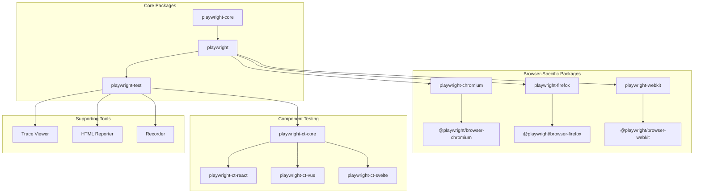

# Playwright Documentation

## Executive Summary

Playwright is a powerful browser automation framework developed by Microsoft that enables reliable end-to-end testing and automation across Chromium, Firefox, and WebKit browsers. Built with a focus on modern web testing needs, Playwright provides a unified API that works consistently across browsers while offering advanced capabilities like auto-waiting, network interception, and mobile emulation.

The project is structured as a monorepo with several key packages:
- **playwright-core**: The foundation that provides browser automation without bundling browsers
- **playwright**: The main package that extends core with browser installations
- **playwright-test**: A complete testing solution with fixtures, parallelization, and reporting
- **Browser-specific packages**: For targeted browser automation
- **Component testing packages**: For testing UI components in isolation

This documentation provides comprehensive information about Playwright's architecture, components, and workflows to help developers effectively use and extend the framework.

## Table of Contents

### Core Documentation
- [Overview](overview.md) - Introduction to Playwright and its capabilities
- [API Reference](api/index.md) - Detailed API documentation
- [Architecture](architecture.md) - Technical architecture and design principles
- [Component Reference](components/index.md) - Documentation for individual components
- [Relationships](relationships.md) - How components interact with each other
- [Workflows](workflows/index.md) - Common usage patterns and workflows

### Technical Specifications
- [Chromium Protocol](components/cGFja2FnZXMvcGxheXdyaWdodC1jb3JlL3NyYy9zZXJ2ZXIvY2hyb21pdW0vcHJvdG9jb2wuZC50cw__.md) - Chromium-specific protocol implementation
- [Core Protocol Types](components/cGFja2FnZXMvcGxheXdyaWdodC1jb3JlL3R5cGVzL3Byb3RvY29sLmQudHM_.md) - Protocol type definitions
- [Core Types](components/cGFja2FnZXMvcGxheXdyaWdodC1jb3JlL3R5cGVzL3R5cGVzLmQudHM_.md) - Core type definitions
- [Client Types](components/cGFja2FnZXMvcGxheXdyaWdodC1jbGllbnQvdHlwZXMvdHlwZXMuZC50cw__.md) - Client-side type definitions
- [Test Types](components/cGFja2FnZXMvcGxheXdyaWdodC90eXBlcy90ZXN0LmQudHM_.md) - Test-related type definitions

### Development Tools and Utilities
- [Dependency Checker](components/check_deps.md) - Tool for checking dependencies
- [Audit Checker](components/check_audit.md) - Security audit tooling
- [Chromium CDN Checker](components/check_chromium_cdn.md) - Tool for verifying Chromium CDN
- [Channel Generator](components/generate_channels.md) - Tool for generating release channels
- [Copyright Information](components/copyright.md) - Copyright and licensing details

## Documentation for Different Audiences

### For Testers and QA Engineers
- [Overview](overview.md) - Get started with Playwright testing
- [API Reference](api/index.md) - Learn the available testing APIs
- [Workflows](workflows/index.md) - Common testing patterns and best practices

### For Developers
- [API Reference](api/index.md) - Detailed API documentation
- [Component Reference](components/index.md) - Understanding individual components
- [Workflows](workflows/index.md) - Integration patterns and usage examples

### For Architects and Technical Leads
- [Architecture](architecture.md) - Technical architecture and design principles
- [Relationships](relationships.md) - Component interactions and dependencies
- [Core Types](components/cGFja2FnZXMvcGxheXdyaWdodC1jb3JlL3R5cGVzL3R5cGVzLmQudHM_.md) - Understanding the type system

### For Contributors
- [Architecture](architecture.md) - Understanding the codebase structure
- [Protocol Documentation](components/cGFja2FnZXMvcGxheXdyaWdodC1jb3JlL3R5cGVzL3Byb3RvY29sLmQudHM_.md) - Browser communication protocols
- [Development Tools](components/check_deps.md) - Tools for development

## Playwright Architecture Overview



## Getting Started

### Installation

```bash
# Install Playwright with the Test Runner
npm init playwright@latest

# Or install Playwright library only
npm install playwright
```

### Basic Usage Example

```javascript
// Example: Basic test with Playwright Test
import { test, expect } from '@playwright/test';

test('basic test', async ({ page }) => {
  // Navigate to a website
  await page.goto('https://playwright.dev/');
  
  // Interact with the page
  await page.click('text=Get Started');
  
  // Assert something on the page
  await expect(page).toHaveTitle(/Playwright/);
});
```

### Key Features

1. **Cross-browser automation**: Run tests on Chromium, Firefox, and WebKit with the same code
2. **Auto-waiting**: Elements are automatically waited for before actions are performed
3. **Network interception**: Monitor and modify network requests and responses
4. **Mobile emulation**: Test responsive designs with device emulation
5. **Powerful selectors**: Locate elements using CSS, XPath, text content, and more
6. **Tracing**: Capture execution traces for debugging and analysis
7. **Component testing**: Test UI components in isolation

### Next Steps

- Explore the [API Reference](api/index.md) to learn about available functionality
- Check out [Workflows](workflows/index.md) for common usage patterns
- Understand the [Architecture](architecture.md) for deeper technical insights

For more detailed information, visit the [official Playwright website](https://playwright.dev).