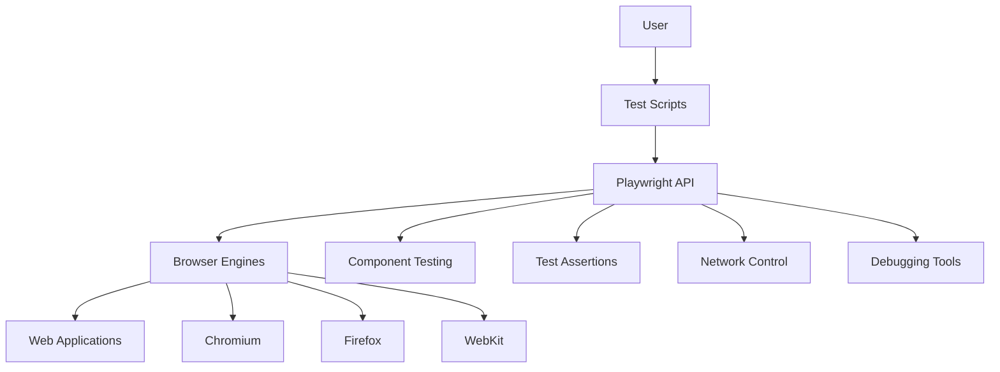

# Playwright Documentation Index

## Executive Summary

Playwright is a powerful browser automation framework that enables reliable end-to-end testing and automation across Chromium, Firefox, and WebKit browsers. It provides a unified API for browser control, user interaction automation, and application behavior verification, with features like auto-waiting, strong isolation, mobile emulation, network control, and comprehensive debugging tools.

## Getting Started

### Installation and Setup
- [Playwright Documentation](index.md) - Complete installation guide
- [Playwright API Reference](api/index.md) - API overview for getting started

### First Steps
- [Playwright Documentation](index.md) - Writing your first test
- [Playwright Workflow Documentation](workflows/index.md) - Understanding test workflow

### Project Configuration
- [Playwright Documentation](index.md) - Configuring your project
- [Playwright Architecture Documentation](architecture.md) - Understanding the framework structure

## Common Tasks

### Browser Automation
- [Playwright API Reference](api/index.md) - Browser control APIs
- [Playwright Documentation](index.md) - Navigation and page interactions

### Element Selection and Interaction
- [Playwright API Reference](api/index.md) - Locator strategies
- [types.d.ts](components/cGFja2FnZXMvcGxheXdyaWdodC1jb3JlL3R5cGVzL3R5cGVzLmQudHM_.md) - Element interaction types

### Writing Assertions
- [test.d.ts](components/cGFja2FnZXMvcGxheXdyaWdodC90eXBlcy90ZXN0LmQudHM_.md) - Test assertion APIs
- [Playwright API Reference](api/index.md) - Assertion examples

### Running Tests
- [Playwright Documentation](index.md) - Test execution options
- [Playwright Workflow Documentation](workflows/index.md) - Test execution workflows

### Working with Forms
- [Playwright API Reference](api/index.md) - Form interaction methods
- [types.d.ts](components/cGFja2FnZXMvcGxheXdyaWdodC1jbGllbnQvdHlwZXMvdHlwZXMuZC50cw__.md) - Form element types

## Advanced Features

### Network Interception
- [protocol.d.ts](components/cGFja2FnZXMvcGxheXdyaWdodC1jb3JlL3NyYy9zZXJ2ZXIvY2hyb21pdW0vcHJvdG9jb2wuZC50cw__.md) - Network protocol details
- [Playwright API Reference](api/index.md) - Request and response handling

### Component Testing
- [Playwright Components Documentation](components/index.md) - Component testing overview
- [test.d.ts](components/cGFja2FnZXMvcGxheXdyaWdodC90eXBlcy90ZXN0LmQudHM_.md) - Component test APIs

### Mobile Emulation
- [Playwright API Reference](api/index.md) - Device emulation
- [types.d.ts](components/cGFja2FnZXMvcGxheXdyaWdodC1jb3JlL3R5cGVzL3R5cGVzLmQudHM_.md) - Device descriptor types

### Authentication Strategies
- [Playwright Workflow Documentation](workflows/index.md) - Authentication workflows
- [Playwright API Reference](api/index.md) - Session and cookie management

### Visual Testing
- [Playwright API Reference](api/index.md) - Screenshot and visual comparison
- [Playwright Documentation](index.md) - Visual testing strategies

### Parallel Test Execution
- [Playwright Documentation](index.md) - Configuring parallelism
- [Playwright Architecture Documentation](architecture.md) - Understanding test isolation

## Troubleshooting

### Debugging Tests
- [Playwright Documentation](index.md) - Debugging techniques
- [Playwright API Reference](api/index.md) - Debugging APIs

### Common Errors
- [Playwright Documentation](index.md) - Resolving frequent issues
- [Playwright Workflow Documentation](workflows/index.md) - Workflow troubleshooting

### Performance Optimization
- [Playwright Architecture Documentation](architecture.md) - Performance considerations
- [Playwright Documentation](index.md) - Test optimization techniques

### Browser-Specific Issues
- [protocol.d.ts](components/cGFja2FnZXMvcGxheXdyaWdodC1jb3JlL3R5cGVzL3Byb3RvY29sLmQudHM_.md) - Browser protocol details
- [Playwright Documentation](index.md) - Browser compatibility

## API Reference

### Core API
- [Playwright API Reference](api/index.md) - Complete API documentation
- [types.d.ts](components/cGFja2FnZXMvcGxheXdyaWdodC1jb3JlL3R5cGVzL3R5cGVzLmQudHM_.md) - Core type definitions

### Test API
- [test.d.ts](components/cGFja2FnZXMvcGxheXdyaWdodC90eXBlcy90ZXN0LmQudHM_.md) - Test framework API
- [Playwright API Reference](api/index.md) - Test utilities

### Component API
- [Playwright Components Documentation](components/index.md) - Component testing API
- [types.d.ts](components/cGFja2FnZXMvcGxheXdyaWdodC1jbGllbnQvdHlwZXMvdHlwZXMuZC50cw__.md) - Client-side types

### Protocol Reference
- [protocol.d.ts](components/cGFja2FnZXMvcGxheXdyaWdodC1jb3JlL3NyYy9zZXJ2ZXIvY2hyb21pdW0vcHJvdG9jb2wuZC50cw__.md) - Chromium protocol
- [protocol.d.ts](components/cGFja2FnZXMvcGxheXdyaWdodC1jb3JlL3R5cGVzL3Byb3RvY29sLmQudHM_.md) - General protocol types

## Quick Solutions

| I want to... | Documentation Section |
|--------------|----------------------|
| Set up Playwright for my project | [Getting Started > Installation and Setup](#installation-and-setup) |
| Write my first test | [Getting Started > First Steps](#first-steps) |
| Find elements on a page | [Common Tasks > Element Selection and Interaction](#element-selection-and-interaction) |
| Click buttons and fill forms | [Common Tasks > Working with Forms](#working-with-forms) |
| Verify page content | [Common Tasks > Writing Assertions](#writing-assertions) |
| Mock API responses | [Advanced Features > Network Interception](#network-interception) |
| Test on mobile viewports | [Advanced Features > Mobile Emulation](#mobile-emulation) |
| Debug failing tests | [Troubleshooting > Debugging Tests](#debugging-tests) |
| Test React/Vue components | [Advanced Features > Component Testing](#component-testing) |
| Speed up my test suite | [Troubleshooting > Performance Optimization](#performance-optimization) |
| Handle authentication | [Advanced Features > Authentication Strategies](#authentication-strategies) |
| Compare screenshots | [Advanced Features > Visual Testing](#visual-testing) |
| Run tests in parallel | [Advanced Features > Parallel Test Execution](#parallel-test-execution) |
| Fix flaky tests | [Troubleshooting > Common Errors](#common-errors) |
| Understand Playwright architecture | [Getting Started > Project Configuration](#project-configuration) |

## Related Resources

- [Playwright Component Relationships: User Guide](relationships.md) - Understanding how components interact
- [Copyright Component Documentation](components/copyright.md) - Copyright information