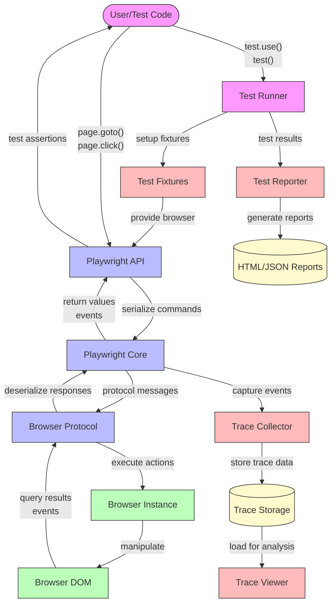

# Playwright Architecture: Component Relationships

## 1. High-Level Overview

Playwright is structured as a monorepo with a carefully designed architecture that enables cross-browser automation through a unified API. The system is built around several key components that work together:

- **Core Engine**: The foundation that provides browser communication protocols and automation primitives
- **Browser-Specific Implementations**: Adaptations for Chromium, Firefox, and WebKit
- **Test Runner**: A comprehensive test execution framework with fixtures and parallelization
- **Component Testing Frameworks**: Specialized tools for testing UI components in isolation
- **Supporting Tools**: Trace viewer, recorder, and reporting utilities

These components interact through well-defined interfaces, allowing for extensibility while maintaining a consistent user experience across different browsers and testing scenarios.

## 2. Component Dependency Diagram

```mermaid
graph TD
    %% Main packages
    playwright[playwright]
    playwright-core[playwright-core]
    playwright-test[playwright-test]
    
    %% Browser-specific packages
    chromium[playwright-chromium]
    firefox[playwright-firefox]
    webkit[playwright-webkit]
    
    %% Browser installation packages
    browser-chromium[@playwright/browser-chromium]
    browser-firefox[@playwright/browser-firefox]
    browser-webkit[@playwright/browser-webkit]
    
    %% Component testing packages
    ct-core[playwright-ct-core]
    ct-react[playwright-ct-react]
    ct-vue[playwright-ct-vue]
    ct-svelte[playwright-ct-svelte]
    ct-react17[playwright-ct-react17]
    
    %% Supporting tools
    html-reporter[html-reporter]
    trace-viewer[trace-viewer]
    recorder[recorder]
    
    %% Dependencies
    playwright --> playwright-core
    chromium --> playwright-core
    firefox --> playwright-core
    webkit --> playwright-core
    
    playwright --> chromium
    playwright --> firefox
    playwright --> webkit
    
    browser-chromium --> chromium
    browser-firefox --> firefox
    browser-webkit --> webkit
    
    playwright-test --> playwright
    
    ct-core --> playwright-test
    ct-react --> ct-core
    ct-vue --> ct-core
    ct-svelte --> ct-core
    ct-react17 --> ct-core
    
    html-reporter --> playwright-test
    trace-viewer --> playwright-core
    recorder --> playwright-core
    
    %% Client packages
    playwright-client[playwright-client]
    playwright-client --> playwright-core
    
    %% MCP package
    playwright-mcp[playwright-mcp]
    playwright-mcp --> playwright-core
    
    %% Web package
    web[web]
    web --> playwright-core
    
    %% Style nodes
    classDef core fill:#f9f,stroke:#333,stroke-width:2px
    classDef browsers fill:#bbf,stroke:#333,stroke-width:1px
    classDef testing fill:#bfb,stroke:#333,stroke-width:1px
    classDef tools fill:#fbb,stroke:#333,stroke-width:1px
    
    class playwright-core core
    class playwright,chromium,firefox,webkit,browser-chromium,browser-firefox,browser-webkit browsers
    class playwright-test,ct-core,ct-react,ct-vue,ct-svelte,ct-react17 testing
    class html-reporter,trace-viewer,recorder,web tools
```

## 3. Data Flow Diagram



## 4. Package Hierarchy Diagram

```mermaid
graph TD
    %% Main hierarchy
    root[Playwright Monorepo]
    
    %% First level packages
    packages[packages/]
    examples[examples/]
    tests[tests/]
    utils[utils/]
    browser_patches[browser_patches/]
    
    %% Package children
    root --> packages
    root --> examples
    root --> tests
    root --> utils
    root --> browser_patches
    
    %% Core packages
    packages --> playwright
    packages --> playwright-core
    packages --> playwright-test
    
    %% Browser-specific packages
    packages --> browser-packages[Browser Packages]
    browser-packages --> playwright-chromium
    browser-packages --> playwright-firefox
    browser-packages --> playwright-webkit
    browser-packages --> playwright-browser-chromium
    browser-packages --> playwright-browser-firefox
    browser-packages --> playwright-browser-webkit
    
    %% Component testing packages
    packages --> ct-packages[Component Testing]
    ct-packages --> playwright-ct-core
    ct-packages --> playwright-ct-react
    ct-packages --> playwright-ct-vue
    ct-packages --> playwright-ct-svelte
    ct-packages --> playwright-ct-react17
    
    %% Tool packages
    packages --> tool-packages[Tools]
    tool-packages --> html-reporter
    tool-packages --> trace-viewer
    tool-packages --> recorder
    tool-packages --> web
    
    %% Examples
    examples --> example-todomvc[todomvc]
    examples --> example-github-api[github-api]
    examples --> example-mock-battery[mock-battery]
    
    %% Tests
    tests --> test-components[components/]
    tests --> test-config[config/]
    tests --> test-installation[installation/]
    
    %% Utils
    utils --> flakiness-dashboard
    utils --> linux-browser-dependencies
    
    %% Browser patches
    browser_patches --> winldd
    
    %% Styles
    classDef rootNode fill:#f9f,stroke:#333,stroke-width:2px
    classDef mainCategory fill:#bbf,stroke:#333,stroke-width:1px
    classDef package fill:#bfb,stroke:#333,stroke-width:1px
    classDef grouping fill:#fbb,stroke:#333,stroke-width:1px
    
    class root rootNode
    class packages,examples,tests,utils,browser_patches mainCategory
    class playwright,playwright-core,playwright-test,playwright-chromium,playwright-firefox,playwright-webkit,html-reporter,trace-viewer,recorder package
    class browser-packages,ct-packages,tool-packages grouping
```



## 5. Key Relationships and Dependencies

### Core Engine and Browser Implementations

The `playwright-core` package serves as the foundation for all browser automation. It defines the protocols and interfaces for communicating with browsers but doesn't include any browser binaries. The browser-specific packages (`playwright-chromium`, `playwright-firefox`, `playwright-webkit`) depend on this core and implement the browser-specific adaptations.

The main `playwright` package serves as an integration point, depending on all three browser implementations to provide a unified API. This layered approach allows users to:
1. Use only specific browsers if desired
2. Utilize the core without bundling browsers (for custom implementations)
3. Access a consistent API regardless of the target browser

### Test Runner and Component Testing

The test runner (`playwright-test`) builds upon the core automation capabilities but adds:
- Test lifecycle management
- Fixture system for dependency injection
- Parallelization and sharding
- Reporting infrastructure

The component testing frameworks extend this further with specialized capabilities for mounting and testing UI components. Each framework-specific package (`playwright-ct-react`, `playwright-ct-vue`, etc.) depends on the common `playwright-ct-core` package, which provides the base functionality for component testing.

### Supporting Tools

Several supporting tools enhance the developer experience:
- The HTML reporter generates test reports and depends on the test runner
- The trace viewer visualizes execution traces and depends on the core
- The recorder helps create tests by recording user interactions

These tools are designed to be optional but integrate seamlessly with the core functionality.

## 6. Areas for Potential Decoupling

### 1. Browser-Specific Implementation Details

Currently, there's tight coupling between the core and browser-specific implementations. While necessary for consistent behavior, this coupling makes it challenging to add support for new browsers or customize browser behavior. Potential improvements:

- More explicit interface definitions between core and browser implementations
- Plugin system for browser adapters to allow third-party browser support
- Configuration points for browser-specific behavior customization

### 2. Test Runner and Core Engine

The test runner is tightly integrated with the core engine. This provides a seamless experience but makes it difficult to use alternative test runners or adapt Playwright to different testing paradigms. Potential improvements:

- Better separation between test runner logic and browser automation
- More explicit APIs for test lifecycle management
- Adapter pattern for integrating with third-party test runners

### 3. Component Testing Framework Dependencies

The component testing frameworks have framework-specific implementations that depend on the core component testing package. This creates maintenance challenges when frameworks update. Potential improvements:

- More flexible mounting strategies that can adapt to framework changes
- Clearer boundaries between framework-specific and common functionality
- Versioning strategy that allows for framework version compatibility

### 4. Reporter and Test Runner Integration

The reporting system is tightly coupled with the test runner, making it challenging to create custom reporters or integrate with external reporting systems. Potential improvements:

- Event-based reporting system with standardized events
- Pluggable reporter architecture with clear extension points
- Separation of test execution data collection from report generation

## 7. Conclusion

Playwright's architecture demonstrates a well-thought-out approach to cross-browser automation and testing. The component relationships show a balance between integration for user experience and separation for maintainability. The core-to-browser relationship is particularly well-designed, allowing for a unified API while accommodating browser-specific differences.

The areas for potential decoupling identified above represent opportunities for evolution rather than critical flaws. As the project continues to grow, addressing these coupling points could enhance extensibility and make it easier for the community to contribute to specific areas without requiring deep knowledge of the entire system.