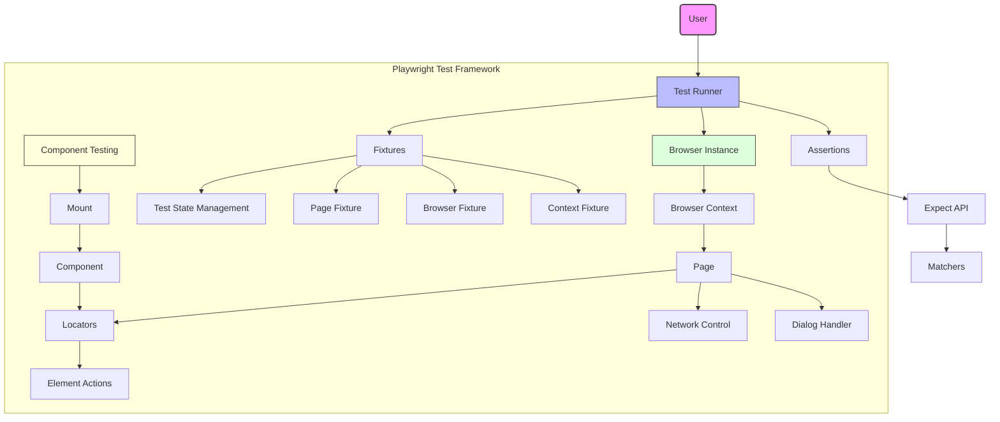
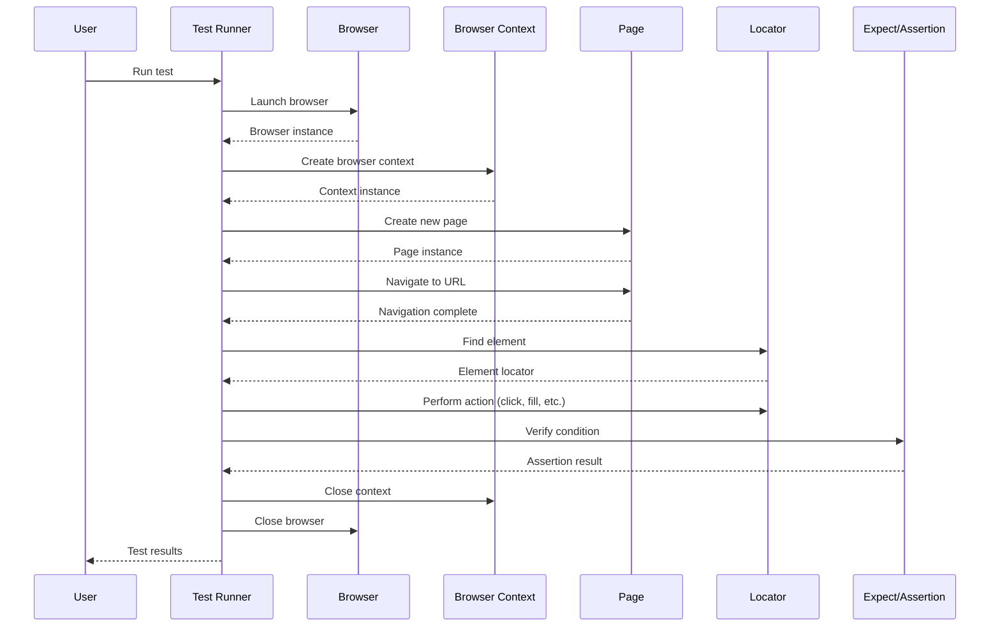
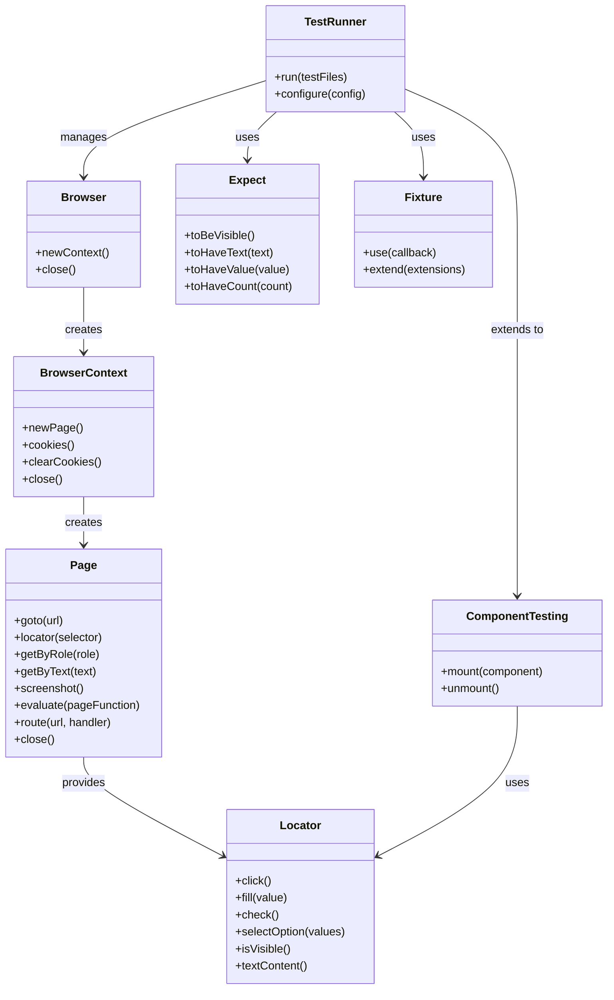

# Playwright Component Relationships: User Guide

## High-Level Overview

Playwright is a comprehensive browser automation framework that enables reliable end-to-end testing across multiple browsers. From a user's perspective, the framework consists of several key components that work together to provide a seamless testing experience.

The core components that users interact with include:

1. **Test Runner** - Executes test files and manages the test lifecycle
2. **Browser Instances** - Chrome/Chromium, Firefox, and WebKit browser automation
3. **Browser Contexts** - Isolated browser sessions (similar to incognito profiles)
4. **Pages** - Individual browser tabs where actions are performed
5. **Locators** - Mechanisms to find and interact with elements on a page
6. **Assertions** - Validation mechanisms to verify expected behaviors
7. **Fixtures** - Reusable test setup and teardown utilities
8. **Component Testing** - Tools for testing UI components in isolation

These components are designed to work together in a hierarchical relationship, with each layer building upon the previous one to provide a complete testing solution.

## Component Dependency Diagram



This diagram illustrates the primary components that users interact with when using Playwright. The Test Runner orchestrates the execution of tests, managing browser instances, contexts, and pages. Locators provide the mechanism to find elements on the page, while assertions validate the expected behavior. Component testing provides specialized tools for testing UI components in isolation.

## User Workflow Diagram



This sequence diagram shows the typical workflow when executing a Playwright test. The test runner launches a browser, creates a context and page, performs actions using locators, and validates behavior using assertions. This workflow represents the core interaction pattern that most users will follow when working with Playwright.

## Conceptual Model Diagram



This class diagram illustrates the conceptual model of Playwright's core components and their relationships. The TestRunner manages the overall test execution, while Browser, BrowserContext, and Page form a hierarchical relationship for browser automation. Locators provide the mechanism to interact with elements on the page, and Expect provides assertions for validation. Fixtures enable reusable test setup and teardown, while ComponentTesting extends the framework for component-specific testing.

## Key Relationships for Users

### Components Typically Used Together

1. **Page and Locators**
   - Pages provide methods to create locators (`page.locator()`, `page.getByRole()`, etc.)
   - Locators are bound to a specific page and used to interact with elements

2. **Locators and Assertions**
   - Locators are often used with assertions to validate element state
   - Example: `await expect(page.getByText('Success')).toBeVisible()`

3. **Browser Contexts and Pages**
   - Each page belongs to a browser context
   - Multiple pages can share the same context for related test scenarios
   - Contexts provide isolation between different test scenarios

4. **Fixtures and Test Runner**
   - Fixtures provide reusable setup/teardown logic
   - The test runner automatically manages built-in fixtures like `page` and `browser`
   - Custom fixtures extend the test runner's capabilities

5. **Component Testing and Mount**
   - Component testing uses the `mount` function to render components
   - Mounted components can be interacted with using locators

### Data Flow During Typical Operations

1. **Navigation Flow**
   - Test initiates navigation via `page.goto(url)`
   - Page loads and renders content
   - Test interacts with elements using locators
   - Assertions validate the expected state

2. **Element Interaction Flow**
   - Test creates a locator to find an element
   - Locator waits for the element to be actionable
   - Action is performed on the element (click, fill, etc.)
   - Page responds to the action (navigation, state change, etc.)
   - Assertions validate the new state

3. **Network Interception Flow**
   - Test sets up route handlers via `page.route()`
   - Page makes network requests during test execution
   - Route handlers intercept matching requests
   - Handlers modify, fulfill, or abort requests
   - Page renders based on the modified network responses

4. **Component Testing Flow**
   - Test mounts a component using `mount()`
   - Component renders in an isolated environment
   - Test interacts with the component using locators
   - Component responds to interactions
   - Assertions validate component behavior

### Required Setup and Initialization

1. **Test Runner Setup**
   - Install Playwright: `npm init playwright@latest`
   - Configure in `playwright.config.js` (browsers, reporters, etc.)
   - Create test files with `.spec.js` or `.spec.ts` extension

2. **Browser Initialization**
   - Automatically handled by the test runner
   - For custom usage: `const browser = await chromium.launch()`

3. **Context Creation**
   - Automatically handled by the test runner
   - For custom usage: `const context = await browser.newContext()`
   - Configure with options like viewport, geolocation, permissions

4. **Page Creation**
   - Automatically handled by the test runner
   - For custom usage: `const page = await context.newPage()`

5. **Component Testing Setup**
   - Install component testing package: `npm install @playwright/experimental-ct-react` (for React)
   - Configure in `playwright-ct.config.js`
   - Create component test files with `.spec.jsx` or `.spec.tsx` extension

### Common Customization and Extension Points

1. **Custom Fixtures**
   - Extend the test runner with custom fixtures for reusable logic
   - Example: Creating a "logged-in" state for multiple tests

   ```javascript
   const test = base.extend({
     loggedInPage: async ({ page }, use) => {
       await page.goto('/login');
       await page.fill('#username', 'user');
       await page.fill('#password', 'pass');
       await page.click('button[type="submit"]');
       await use(page);
     }
   });
   ```

2. **Test Hooks**
   - Use `beforeEach`, `afterEach`, `beforeAll`, and `afterAll` for setup/teardown
   - Example: Setting up test data before tests run

   ```javascript
   test.beforeAll(async () => {
     // Setup test database
   });
   ```

3. **Custom Assertions**
   - Extend the expect API with custom matchers
   - Example: Creating a custom matcher for application-specific validation

   ```javascript
   expect.extend({
     toBeValidUser(received) {
       return {
         pass: received && received.id && received.name,
         message: () => `Expected ${received} to be a valid user`
       };
     }
   });
   ```

4. **Test Runner Plugins**
   - Implement the `TestRunnerPlugin` interface to extend the test runner
   - Example: Custom reporting, test filtering, or environment setup

5. **Component Testing Hooks**
   - Customize component mounting behavior with hooks
   - Example: Providing context providers or theme wrappers

   ```javascript
   // playwright/index.ts
   export const customHooks = {
     mount: async (component, options) => {
       return mount(
         <ThemeProvider theme="light">
           {component}
         </ThemeProvider>,
         options
       );
     }
   };
   ```

## Do's and Don'ts

### Do's

1. **Do use locators instead of selectors when possible**
   - Locators provide auto-waiting and retry mechanisms
   - Role-based locators (`getByRole`, `getByText`) are more resilient to UI changes

2. **Do create isolated tests with fresh browser contexts**
   - Each test should start with a clean state
   - Use the built-in isolation provided by the test runner

3. **Do leverage fixtures for common setup**
   - Extract repeated setup into fixtures
   - Use built-in fixtures like `page` and `browser` when possible

4. **Do use auto-waiting capabilities**
   - Let Playwright handle waiting for elements to be actionable
   - Avoid explicit waits when possible

5. **Do use the trace viewer for debugging**
   - Enable traces with `--trace on` for detailed debugging information
   - Use screenshots and videos for visual debugging

6. **Do organize tests by user flows**
   - Structure tests around user journeys and scenarios
   - Focus on testing behavior rather than implementation details

7. **Do use component testing for UI components**
   - Test components in isolation before integration
   - Use component testing for faster feedback cycles

### Don'ts

1. **Don't mix Playwright with other browser automation tools in the same test**
   - Stick to Playwright's API for consistent behavior
   