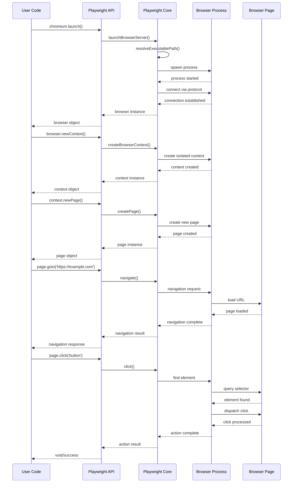
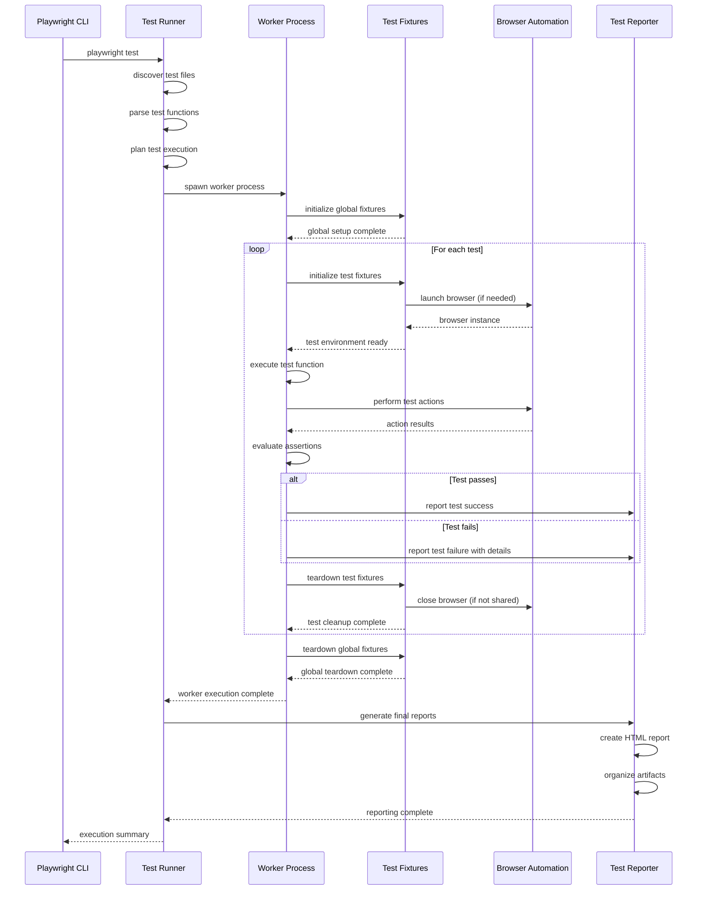
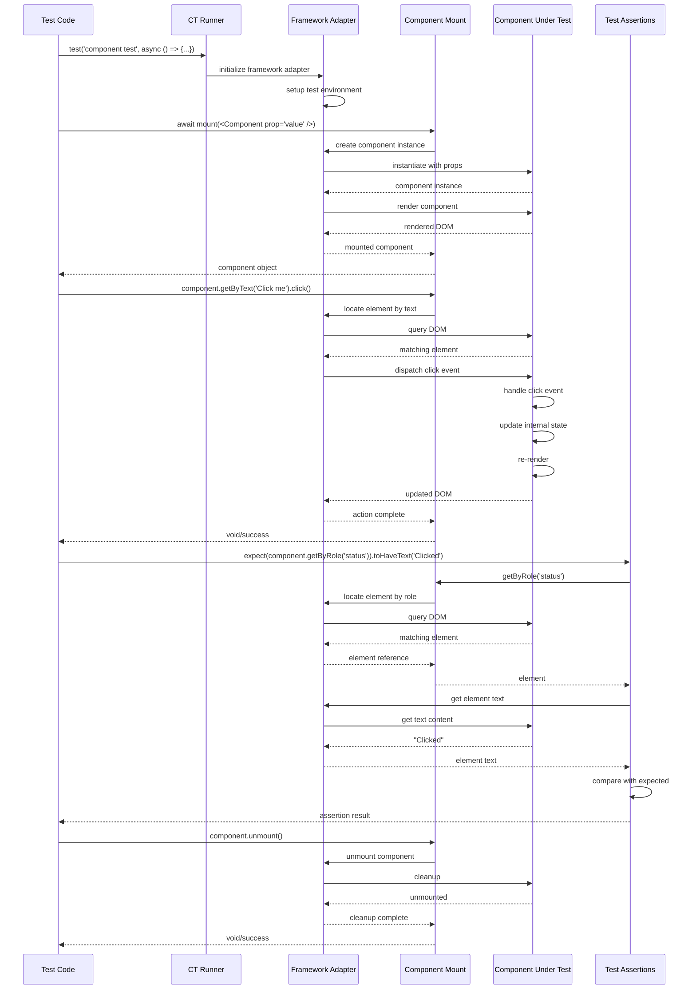

# Playwright Workflow Documentation

## Table of Contents

1. [Introduction](#introduction)
2. [Core Workflows](#core-workflows)
   - [Browser Automation Workflow](#browser-automation-workflow)
   - [Test Execution Workflow](#test-execution-workflow)
   - [Component Testing Workflow](#component-testing-workflow)
   - [Trace Recording and Visualization Workflow](#trace-recording-and-visualization-workflow)
   - [Browser Installation Workflow](#browser-installation-workflow)
3. [Sequence Diagrams](#sequence-diagrams)
   - [Browser Launch and Page Navigation](#browser-launch-and-page-navigation)
   - [Test Execution Flow](#test-execution-flow)
   - [Component Test Rendering and Interaction](#component-test-rendering-and-interaction)
4. [Common Patterns and Best Practices](#common-patterns-and-best-practices)
5. [Error Handling Strategies](#error-handling-strategies)

## Introduction

Playwright is a comprehensive browser automation framework designed for end-to-end testing, component testing, and general browser automation tasks. This document outlines the key workflows within the Playwright ecosystem, detailing how different components interact to provide a seamless testing and automation experience across multiple browsers.

## Core Workflows

### Browser Automation Workflow

**Purpose**: Enable automated control of browsers (Chromium, Firefox, WebKit) through a unified API.

**Triggering Events**:
- User code calling browser launch methods
- Test runner initializing browser instances
- Component testing framework setting up test environment

**Steps and Sequence**:

1. **Browser Launch**:
   - User requests browser instance via `playwright.chromium.launch()` (or equivalent for other browsers)
   - Playwright Core identifies the appropriate browser executable
   - Browser process is spawned with specific configuration parameters
   - Connection is established with the browser using the appropriate protocol

2. **Context Creation**:
   - Browser context is created as an isolated browser session
   - Context-specific parameters are applied (viewport, geolocation, permissions, etc.)
   - Storage state is initialized if provided

3. **Page Interaction**:
   - New page is created within the context
   - Navigation requests are sent to the browser
   - DOM selectors are resolved to locate elements
   - User interactions (click, type, etc.) are translated to protocol commands
   - Responses and events from the browser are captured and returned

4. **Resource Management**:
   - Pages, contexts, and browsers are tracked for proper cleanup
   - Resources are released in reverse order of creation

**Components Involved**:
- `playwright-core`: Provides the foundation for browser communication
- Browser-specific packages: Implement browser-specific protocol details
- Server-side API: Manages browser processes and communication
- Client-side API: Provides user-facing methods for browser control

**Error Handling**:
- Connection failures trigger retry mechanisms with exponential backoff
- Selector timeouts provide detailed error messages about missing elements
- Browser crashes are detected and reported with diagnostic information
- Protocol errors are translated to meaningful JavaScript exceptions

### Test Execution Workflow

**Purpose**: Provide a structured environment for running automated tests with proper isolation, parallelization, and reporting.

**Triggering Events**:
- Running `npx playwright test` command
- CI/CD pipeline executing test scripts
- IDE test runner integration

**Steps and Sequence**:

1. **Test Discovery**:
   - Test files are identified based on configuration patterns
   - Test functions are extracted and organized into test suites
   - Test metadata (tags, annotations) is collected

2. **Test Planning**:
   - Tests are grouped based on configuration (project, shard)
   - Execution order is determined based on dependencies and priorities
   - Parallelization strategy is computed based on available resources

3. **Worker Initialization**:
   - Worker processes are spawned for parallel execution
   - Global setup hooks are executed
   - Test-specific fixtures are prepared

4. **Test Execution**:
   - Each test is run in isolation with its required fixtures
   - Browser instances are created as needed (shared or dedicated)
   - Test assertions are evaluated
   - Screenshots and videos are captured based on configuration
   - Test results are collected (pass, fail, skip, etc.)

5. **Reporting**:
   - Test results are aggregated across workers
   - Reports are generated in configured formats (HTML, JSON, etc.)
   - Artifacts (screenshots, videos, traces) are organized
   - Global teardown hooks are executed

**Components Involved**:
- `playwright-test`: Implements the test runner and fixture system
- `html-reporter`: Generates visual test reports
- `trace-viewer`: Captures and visualizes test execution traces
- Test fixtures: Provide isolated test environments and resources

**Error Handling**:
- Test failures are captured with detailed error messages
- Flaky tests can be automatically retried based on configuration
- Timeouts are enforced at multiple levels (test, fixture, step)
- Worker crashes are detected and reported with diagnostic information

### Component Testing Workflow

**Purpose**: Enable testing of UI components in isolation across different frontend frameworks.

**Triggering Events**:
- Running component tests via `npx playwright test -c playwright-ct.config.ts`
- Development workflow testing components during implementation

**Steps and Sequence**:

1. **Component Mounting**:
   - Component code is loaded and parsed
   - Framework-specific mounting strategy is applied
   - Component is rendered in an isolated environment
   - Initial props and state are applied

2. **Component Interaction**:
   - Component is queried using selectors
   - User interactions are simulated (click, input, etc.)
   - Component state changes are triggered
   - Component updates are rendered

3. **Assertion Evaluation**:
   - Component state is examined
   - DOM structure is verified
   - Visual appearance is compared (if configured)
   - Event emissions are validated

4. **Cleanup**:
   - Component is unmounted
   - Test environment is reset for the next test

**Components Involved**:
- `playwright-ct-core`: Provides base component testing functionality
- Framework-specific packages (`playwright-ct-react`, `playwright-ct-vue`, `playwright-ct-svelte`): Implement framework-specific mounting strategies
- Injected scripts: Bridge between test code and component under test
- Test fixtures: Provide component testing environment

**Error Handling**:
- Component mounting failures provide detailed error messages
- Selector timeouts indicate missing elements in the component
- Framework-specific errors are captured and reported
- Assertion failures include component state details

### Trace Recording and Visualization Workflow

**Purpose**: Capture detailed information about test execution for debugging and analysis.

**Triggering Events**:
- Tests running with tracing enabled
- Manual trace recording via API
- Opening trace files in the Trace Viewer

**Steps and Sequence**:

1. **Trace Recording**:
   - Trace recording is initialized based on configuration
   - Browser events are captured (network, console, etc.)
   - Screenshots are taken at specified intervals
   - User interactions are recorded with timing information
   - Trace data is serialized and stored

2. **Trace Storage**:
   - Trace data is compressed and saved to disk
   - Metadata is attached (test name, browser, etc.)
   - Screenshots and other artifacts are included

3. **Trace Visualization**:
   - Trace Viewer loads trace file
   - Timeline is constructed from events
   - Screenshots are synchronized with timeline
   - Network requests and responses are parsed
   - Console messages are displayed

4. **Trace Interaction**:
   - User navigates timeline to specific points
   - Screenshots show browser state at selected time
   - Action details are displayed
   - Source locations are linked to actions

**Components Involved**:
- Tracing infrastructure in `playwright-core`
- `trace-viewer` package for visualization
- Browser instrumentation for event capture
- Storage utilities for trace compression and serialization

**Error Handling**:
- Trace recording failures are reported but don't fail tests
- Corrupt trace files are detected with meaningful error messages
- Missing screenshots or events are handled gracefully
- Large traces are optimized for performance

### Browser Installation Workflow

**Purpose**: Automatically download and install browser binaries required by Playwright.

**Triggering Events**:
- Installing Playwright packages
- Running `npx playwright install` command
- First use of a browser that hasn't been installed

**Steps and Sequence**:

1. **Browser Detection**:
   - Check if required browsers are already installed
   - Determine which browsers need to be downloaded
   - Verify system requirements for each browser

2. **Download Process**:
   - Resolve browser version based on Playwright version
   - Determine appropriate download URL for the platform
   - Create download directory structure
   - Download browser archive with progress reporting

3. **Installation**:
   - Extract browser archive to appropriate location
   - Set executable permissions if needed
   - Install additional dependencies if required
   - Verify installation with basic launch check

4. **Registration**:
   - Register installed browser in Playwright's registry
   - Update browser paths for future launches
   - Clean up temporary files

**Components Involved**:
- Browser registry in `playwright-core`
- Browser-specific packages for version information
- Download and extraction utilities
- Platform-specific installation helpers

**Error Handling**:
- Network failures trigger retries with exponential backoff
- Corrupt downloads are detected and retried
- Permission issues provide clear guidance for resolution
- Dependency issues suggest platform-specific solutions

## Sequence Diagrams

### Browser Launch and Page Navigation

### Test Execution Flow

### Component Test Rendering and Interaction

## Common Patterns and Best Practices

### 1. Fixture-Based Resource Management

Playwright uses a fixture-based approach for managing resources throughout test execution. This pattern ensures proper initialization, sharing, and cleanup of resources.

**Key Aspects**:
- **Dependency Declaration**: Tests explicitly declare their dependencies through fixture usage
- **Automatic Cleanup**: Fixtures handle resource cleanup in reverse order of creation
- **Scoped Resources**: Resources can be scoped to test, worker, or project levels
- **Parallel Safety**: Fixtures are designed to be safe for parallel execution

**Best Practices**:
- Use the narrowest scope possible for fixtures to improve parallelization
- Leverage auto-fixtures for common resources like browsers and pages
- Create custom fixtures for application-specific resources
- Use fixture dependencies to model complex resource relationships

### 2. Protocol-Based Browser Communication

Playwright communicates with browsers through custom protocols, providing a unified abstraction layer over different browser engines.

**Key Aspects**:
- **Protocol Translation**: Browser-specific protocols are translated to a unified API
- **Asynchronous Communication**: All browser interactions are asynchronous
- **Event-Based Architecture**: Browser events are propagated through an event system
- **Isolation Mechanisms**: Contexts provide isolation between test scenarios

**Best Practices**:
- Use high-level APIs when possible instead of direct protocol access
- Leverage browser contexts for test isolation
- Handle asynchronous operations properly with async/await
- Consider browser-specific behaviors when writing cross-browser tests

### 3. Selector-Based Element Interaction

Playwright uses a robust selector engine